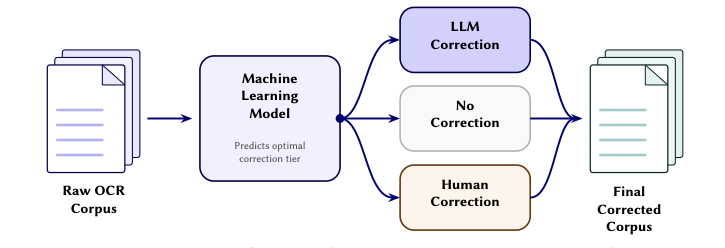
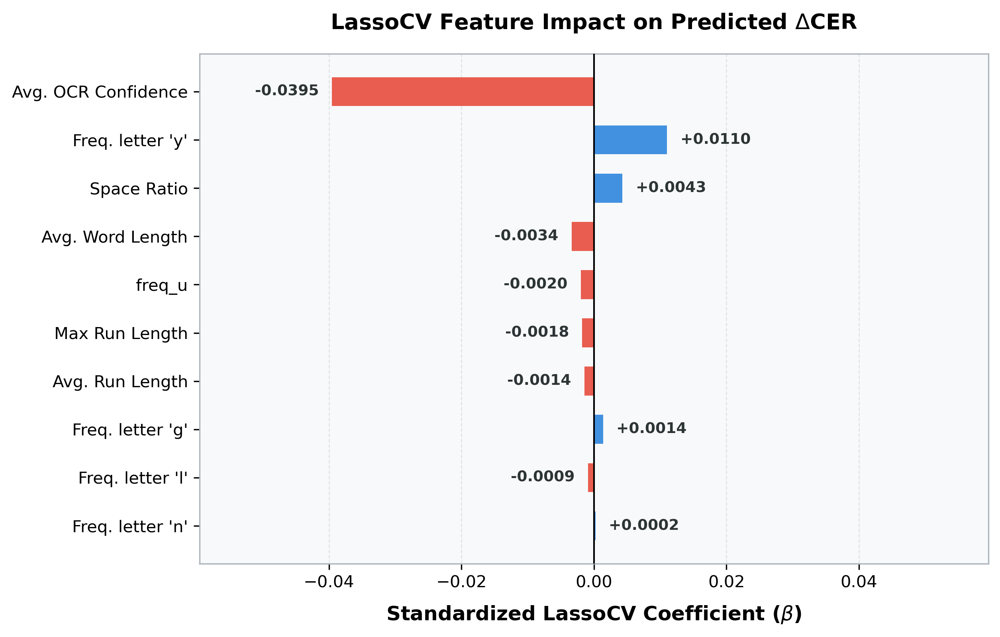

# Cost-Aware Human-LLM Collaboration for post-OCR Corrections in Swiss Historical Newspapers

This repository contains the code, data, and LaTeX manuscript for the DocEng 2026 short paper.

## Project Overview

We propose a three-tier collaboration framework that routes each OCR text segment to the most cost-effective correction path: (1) **No Correction**, (2) **LLM Correction**, or (3) **Human Correction**. A LassoCV regression model trained on 54 lightweight features extracted from the raw OCR output predicts per-document CER improvement (ΔCER), enabling regression-guided routing that closely tracks the Oracle frontier. A safeguard classifier detects cases where LLM correction would harm quality and routes them to human review.



### Key Results

| % Corrected | ConfBERT | Ours | Ours + Safeguard | Oracle |
|---|---|---|---|---|
| 0% | 6.32 | 6.32 | 6.32 | 6.32 |
| 25% | 5.06 | 3.85 | **3.48** | 3.16 |
| 50% | 3.72 | 3.08 | **2.66** | 2.60 |
| 75% | 3.25 | 3.04 | **2.62** | 2.50 |
| 100% | 2.98 | 2.98 | **2.56** | 2.98 |

With <5% of documents routed to human review (29 docs), the safeguard achieves **2.56% CER** — a 14% relative reduction over the All-LLM baseline (2.98%).

---

## Directory Structure

```text
.
├── code/
│   ├── experiments/
│   │   ├── experiment_gbt_classifier.py  # Core data loading & feature extraction
│   │   ├── confbert_router.py            # ConfBERT baseline (Hemmer et al.)
│   │   └── compute_salient_features.py   # LassoCV coefficient analysis
│   ├── plotting/
│   │   ├── plot_safeguard_routing.py     # Figure 2: routing frontier + safeguard
│   │   └── plot_lasso_feature_impact.py  # Figure 3: LassoCV feature coefficients
│   ├── evaluation/
│   │   ├── run_evaluations.py            # Main evaluation pipeline
│   │   ├── rebuild_baselines.py          # OCR baseline reconstruction
│   │   └── update_confidence_data.py     # OCR confidence extraction
│   └── utils/
│       └── regression_features.py        # 54-dimensional feature engineering
├── data/
│   └── evaluation_dataset/               # 609 text segments + page images
├── paper/
│   ├── main.tex                          # LaTeX manuscript
│   ├── main.bib                          # Bibliography
│   └── figures/                          # Paper figures
├── results/
│   ├── corrections/                      # LLM correction outputs (Full mode)
│   │   ├── tesseract/                    # 10 prompts × 8 models
│   │   ├── easyocr/                      # 10 prompts × 8 models
│   │   └── paddle/                       # 10 prompts × 2 models
│   ├── baselines/                        # Raw OCR baseline metrics
│   ├── confidence_data/                  # Tesseract word-level confidence
│   ├── ml_models/                        # Cached features & ConfBERT probas
│   └── summaries/                        # Aggregated leaderboard metrics
└── requirements.txt
```

---

## Getting Started

### 1. Environment Setup

```bash
python3 -m venv venv
source venv/bin/activate
pip install -r requirements.txt
```

### 2. Configuration

Create a `.env` file with your OpenRouter API key (needed for LLM corrections):
```text
OPENROUTER_API_KEY=your_key_here
```

---

## Reproducing Paper Figures

### Figure 2: CER Routing Frontier with Safeguard

```bash
python code/plotting/plot_safeguard_routing.py
```

Generates `paper/figures/safeguard_routing_plot.png` — compares routing curves for Oracle, Ours (LassoCV), Ours + Safeguard, and ConfBERT baseline.

### Figure 3: LassoCV Feature Impact

```bash
python code/plotting/plot_lasso_feature_impact.py
```

Generates `paper/figures/lasso_feature_impact.png` — standardized LassoCV coefficients for predicting ΔCER.

---

## Corpus

609 text segments from nine Swiss historical newspapers (1733–1945) in the digital archives of the Canton of Vaud.

| Newspaper | Dates | Issues | Pages | Segments |
|---|:---:|:---:|:---:|:---:|
| La Revue | 1875–1945 | 4 | 5 | 139 |
| Feuille d'Avis | 1762–1841 | 4 | 13 | 131 |
| Tribune de Lausanne | 1912 | 3 | 4 | 105 |
| Nouvelliste Vaudois | 1822–1840 | 3 | 7 | 90 |
| Petite Revue | 1943 | 1 | 1 | 46 |
| Lausanne Artistique | 1926 | 1 | 1 | 32 |
| Almanach | 1832 | 1 | 8 | 31 |
| Estafette | 1862 | 1 | 1 | 19 |
| Mercure Suisse | 1733–1738 | 2 | 5 | 16 |
| **Total** | **1733–1945** | **20** | **45** | **609** |

Of these, 609 segments have successful OCR scans (12 failed scans return empty strings).

---

## Feature Set (54 Features)

The routing model uses 54 features extracted exclusively from the raw OCR text and document metadata (no ground truth required).

### Text-Surface Features (41)

| Feature | Description |
|---|---|
| `text_length`, `word_count`, `avg_word_length` | Character/word-level statistics |
| `unique_char_ratio` | Ratio of unique to total characters |
| `digit_ratio`, `punct_ratio`, `upper_ratio` | Character-type ratios |
| `newline_density`, `space_ratio` | Layout density proxies |
| `freq_a` … `freq_z` | Per-letter frequency (26 features) |
| `max_run_length`, `avg_run_length` | Consecutive identical character runs |
| `spell_length_ratio` | Raw OCR length / spell-corrected length |
| `ortho_integrity_word`, `ortho_integrity_char` | Fraction unchanged by French spell-checker |
| `dict_hit_rate` | Fraction of words in French dictionary |

### Metadata Features (13)

| Feature | Description |
|---|---|
| `num_lines`, `avg_chars_per_line` | Layout density |
| `publication_year` | Document date |
| `newspaper_*` (9 features) | One-hot encoding of newspaper source |
| `avg_confidence` | Per-document average OCR confidence score |

---

## LassoCV Feature Salience

Only 11 of 54 features receive non-zero coefficients, confirming the Lasso's sparsity:

| Rank | Feature | Coefficient | Interpretation |
|---|---|---|---|
| 1 | `avg_confidence` | −0.0395 | Higher confidence → less room for improvement |
| 2 | `freq_y` | +0.0110 | Frequency of letter 'y' |
| 3 | `space_ratio` | +0.0043 | Layout issues the LLM can fix |
| 4 | `avg_word_length` | −0.0034 | Shorter words → fragmented OCR |
| 5 | `freq_u` | −0.0020 | Frequency of letter 'u' |
| 6 | `max_run_length` | −0.0018 | Max consecutive identical characters |
| 7 | `avg_run_length` | −0.0014 | Avg consecutive identical characters |
| 8 | `freq_g` | +0.0014 | Frequency of letter 'g' |
| 9 | `freq_l` | −0.0009 | Frequency of letter 'l' |
| 10 | `freq_n` | +0.0002 | Frequency of letter 'n' |
| 11 | `freq_e` | −0.0001 | Frequency of letter 'e' |



---

## Prompt Ablation (Supplementary)

We evaluated 10 prompt templates of increasing complexity with **Gemini 3 Flash** across all three OCR engines:

| Prompt | Level | Tesseract (WER/CER) | EasyOCR (WER/CER) | PaddleOCR (WER/CER) |
|---|---|---|---|---|
| **Baseline** | — | 0.234 / 0.063 | 0.599 / 0.151 | 0.167 / 0.042 |
| A | Basic | 0.119 / 0.032 | 0.473 / 0.105 | 0.115 / 0.031 |
| B | Basic+ | 0.141 / 0.037 | 0.447 / 0.095 | 0.140 / 0.038 |
| C | Intermediate | 0.119 / 0.033 | 0.146 / 0.040 | 0.090 / 0.028 |
| D | Intermediate+ | 0.113 / 0.033 | 0.162 / 0.044 | 0.097 / 0.032 |
| E | Advanced | 0.114 / 0.036 | 0.292 / 0.181 | 0.089 / 0.033 |
| F | Advanced+ | 0.131 / 0.042 | 0.200 / 0.057 | 0.100 / 0.032 |
| G | Expert (few-shot) | 0.138 / 0.040 | 0.189 / 0.051 | 0.131 / 0.039 |
| **H** | **Expert Robuste** | **0.095 / 0.029** | **0.118 / 0.039** | **0.077 / 0.027** |
| I | Master (CoT) | 0.107 / **0.028** | 0.164 / 0.047 | 0.086 / **0.027** |
| J | Ultimate | 0.124 / 0.036 | 0.162 / 0.049 | 0.099 / 0.032 |

Prompt H (Expert Robuste) achieves the best WER across all engines. The paper reports results using this prompt with Gemini 3 Flash and Tesseract.

---

*DocEng 2026 — Short Paper*
